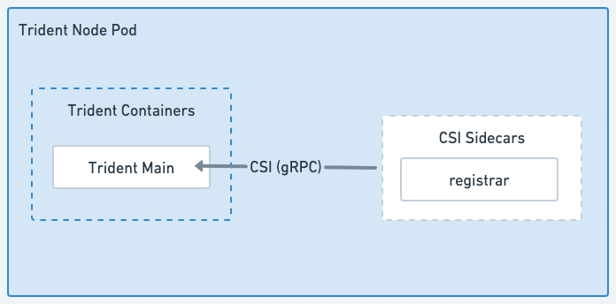

= Trident 架構
:hardbreaks:
:allow-uri-read: 
:icons: font
:imagesdir: ../media/

[role="lead"]
Trident 以單一 Controller Pod 和叢集中每個工作節點上的一個 Node Pod 的形式運作。Node Pod 必須運行在您希望掛載 Trident 磁碟區的任何主機上。

== 了解控制器 Pod 和節點 Pod

Trident 在 Kubernetes 叢集上部署為單一 <<Trident Controller Pod>> 和一個或多個 <<Trident 節點 Pod>>，並使用標準 Kubernetes _CSI Sidecar Containers_ 來簡化 CSI 外掛程式的部署。link:https://kubernetes-csi.github.io/docs/sidecar-containers.html["Kubernetes CSI Sidecar 容器"^] 由 Kubernetes Storage 社群維護。

Kubernetes link:https://kubernetes.io/docs/concepts/scheduling-eviction/assign-pod-node/["節點選取器"^] 和 link:https://kubernetes.io/docs/concepts/scheduling-eviction/taint-and-toleration/["容忍度與污點"^] 用於將 Pod 限制在特定或首選節點上運行。您可以在 Trident 安裝期間為控制器 Pod 和節點 Pod 設定節點選擇器和容錯範圍。

* 控制器外掛程式負責處理磁碟區配置和管理，例如快照和調整大小。
* 節點外掛程式負責將儲存設備連接到節點。

.Trident 已部署在 Kubernetes 叢集上
image::../media/trident-arch.png[Kubernetes 叢集上的 Trident 架構圖。]

=== Trident Controller Pod

Trident Controller Pod 是一個運行 CSI Controller 插件的單一 Pod 。

* 負責在 NetApp 儲存設備中配置和管理磁碟區
* 由 Kubernetes Deployment 管理
* 可以在控制平面或工作節點上執行，具體取決於安裝參數。

.Trident Controller Pod 示意圖
image::../media/controller-pod.png[運行 CSI Controller 外掛程式及適用 CSI Sidecar 的 Trident Controller Pod 示意圖。]

=== Trident 節點 Pod

Trident Node Pod 是執行 CSI Node 外掛程式的特權 Pod。

* 負責掛載和卸載主機上執行的 Pod 儲存設備
* 由 Kubernetes DaemonSet 管理
* 必須在任何能夠掛載 NetApp 儲存設備的節點上執行

.Trident 節點 Pod 示意圖

== 支援的 Kubernetes 叢集架構

Trident 支援下列 Kubernetes 架構：

[cols="3,1,2"]
|===
| Kubernetes 叢集架構 | 支援 | 預設安裝 

| 單一主節點、運算節點 | 是的  a| 
是的

| 多主機、運算 | 是的  a| 
是的

| 主節點、 `etcd`運算 | 是的  a| 
是的

| 主節點、基礎架構、運算 | 是的  a| 
是的

|===